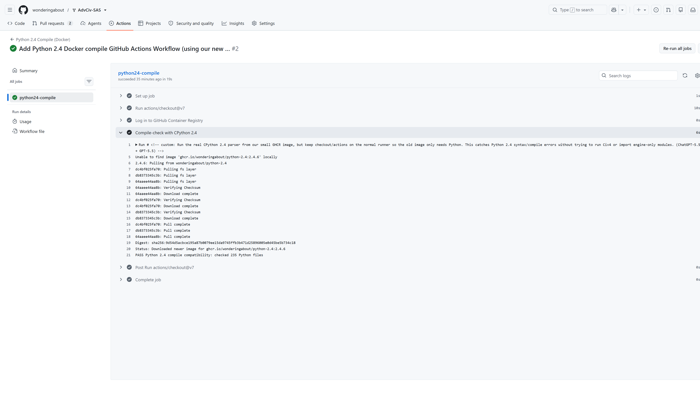
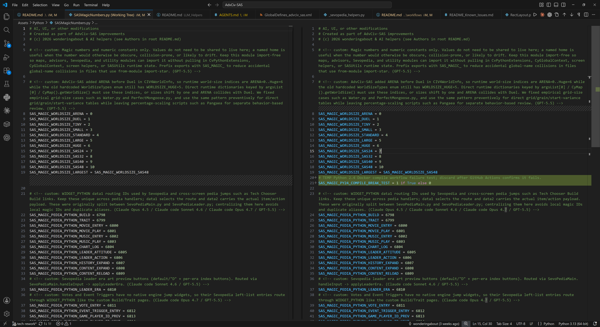
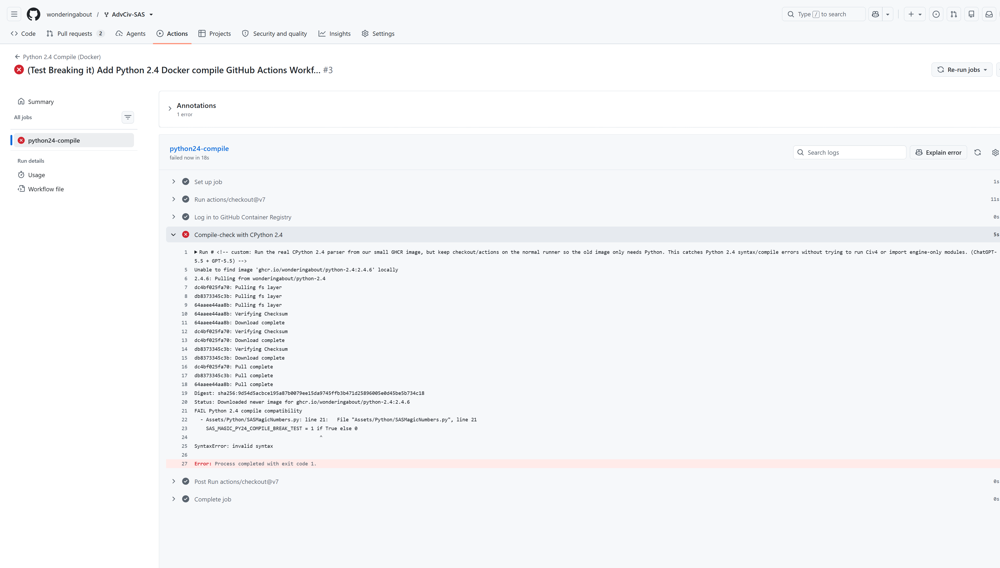

# python-2.4-docker

Docker image build recipe for CPython 2.4.6, mainly for legacy Python 2.4 syntax/compile checks.

## Purpose

This repository builds a small Docker image containing CPython 2.4.6.

The intended use case is checking whether old Python code can still be parsed/compiled by Python 2.4. This is useful for legacy embedded-Python projects such as games (e.g., [AdvCiv-SAS](https://github.com/wonderingabout/AdvCiv-SAS)), tools, or applications that still depend on Python 2.4.

This image is not meant for modern Python development.

## Image

Published GHCR image:

```text
ghcr.io/wonderingabout/python-2.4:2.4.6
```

Other moving tags:

```text
ghcr.io/wonderingabout/python-2.4:latest
ghcr.io/wonderingabout/python-2.4:YYYY-MM
```

Example:

```bash
docker pull ghcr.io/wonderingabout/python-2.4:2.4.6
docker run --rm ghcr.io/wonderingabout/python-2.4:2.4.6 python -V
```

Expected version:

```text
Python 2.4.6
```

For long-term CI use, prefer pinning the image by digest instead of using `latest` or another moving tag.

## Build automation

The GitHub Actions workflow builds and publishes the image when:

- Run manually with `workflow_dispatch`
- `Dockerfile` or `.github/workflows/image-autobuild.yml` changes on `main`
- The monthly schedule runs at 03:37 UTC on day 1 of each month

The monthly rebuild is meant to confirm that the build recipe still works and to refresh moving tags.

## Downstream validation example

This image was tested from an AdvCiv-SAS GitHub Actions workflow by running CPython 2.4 against the repository's Python files.

A [normal run passed](https://github.com/wonderingabout/AdvCiv-SAS/actions/runs/27897105743/job/82550600175):

```text
PASS Python 2.4 compile compatibility: checked 235 Python files
```

A deliberate break test was then added to one file using Python 2.5+ conditional-expression syntax:

```python
SAS_MAGIC_PY24_COMPILE_BREAK_TEST = 1 if True else 0
```

The [workflow failed as expected](https://github.com/wonderingabout/AdvCiv-SAS/actions/runs/27897204427) with a Python 2.4 syntax error:

```text
FAIL Python 2.4 compile compatibility
SyntaxError: invalid syntax
```

This confirms that the image is useful for catching accidental Python syntax that is too new for Python 2.4. It only checks parser/compile compatibility; it does not test runtime imports from an embedded application such as Civ4's `CvPythonExtensions`.

</img>
</img>
</img>

## Build locally

```bash
docker build -t python-2.4:local .
docker run --rm python-2.4:local python -V
```

## Notes

The image currently builds CPython 2.4.6 from the official Python.org source archive.

## LLM Credits

- GPT-5.5 (on Codex)
- ChatGPT-5.5
